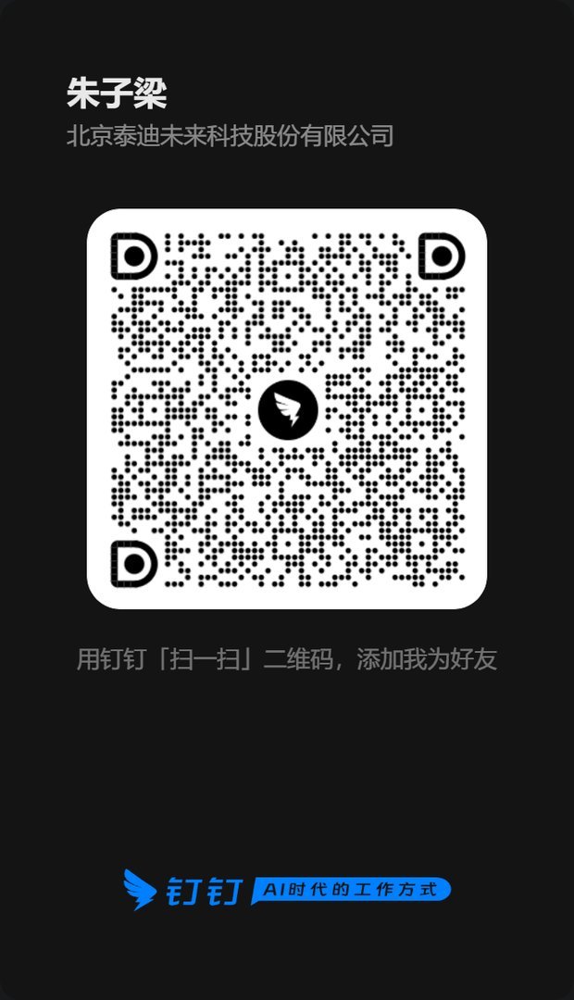

# Contact VoxAgent

Thank you for your interest in VoxAgent.

## Official Channels

- Official website: https://vox-ai.teddymobile.cn/
- Trial application: https://vox-ai.teddymobile.cn/trial/apply
- Product overview: https://vox-ai.teddymobile.cn/product
- Public documentation: https://vox-ai.teddymobile.cn/docs
- Email: zhuziliang@teddymobile.cn
- DingTalk: scan the QR code below to add Zhu Ziliang.



## What To Contact Us About

- Product evaluation and trial access.
- AI agent phone integration.
- Inbound, outbound, or batch outbound call scenarios.
- Sandbox validation and production access preparation.
- Business partnership, ecosystem collaboration, or technical integration.
- Documentation feedback and public project questions.

## Recommended Inquiry Template

When contacting us, please include:

```text
Company / Team:
Contact person:
Contact method:
Use case:
Expected call mode: inbound / outbound / batch outbound / mixed
Existing AI agent or system:
Expected timeline:
Questions:
```

## GitHub Issues

GitHub Issues can be used for public documentation feedback, product questions, and community suggestions.

Please do not post private credentials, app secrets, phone numbers, production account information, customer data, or sensitive business information in public issues.

## Additional Contact Channels

If different teams handle different requests, consider adding separate addresses for product evaluation, business partnership, media, and technical support.
